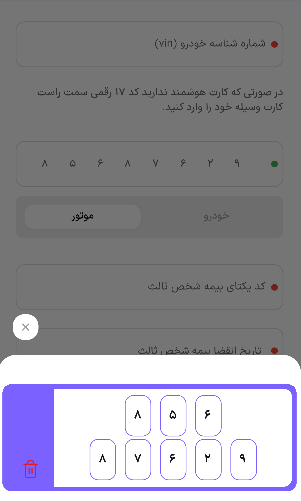

# Plate Number Input Package

A Flutter package that provides a customizable widget for collecting vehicle or motorcycle license
plate numbers from users.

## Examples

<div style="display: inline-block; text-align: center; margin: 10px;">
  
  <br/>
  <small>Default usage example</small>
</div>

<div style="display: inline-block; text-align: center; margin: 10px;">
  
  <br/>
  <small>Real project implementation</small>
</div>

## Features

- **Dynamic Spacing**: Adjust spacing between widgets using the `spacingScale` parameter.
- **Custom Widgets**: Option to add custom widgets for letters and removal actions.
- **Flexible Styling**: Customize text styles for numbers and letters, as well as border radius.
- **Interactive Letter Selection**: Callback for handling letter selection.
- **Input Validation**: Prevents the entry of invalid characters such as ".", "-", and " " in
  numeric text fields.

## Installation

To use this package, add it to your `pubspec.yaml` file:

```yaml
dependencies:
  plate_number: ^0.0.1
```

Then run the following command to install the package:

```bash
flutter pub get
```

## Usage

To get started with the package, you need to create a PlateCardBloc that manages the state of the
selected plate type. This bloc should be defined in your widget tree using BlocProvider. Below is an
example of how to implement this in your Flutter application:

```dart
import 'package:flutter/cupertino.dart';
import 'package:flutter/material.dart';
import 'package:flutter_bloc/flutter_bloc.dart';
import 'package:plate_number/bicycle_plate/index.dart';
import 'package:plate_number/car_plate/index.dart';
import 'package:plate_number/widgets/show_plate.dart';

void main() {
  runApp(MyApp());
}

class MyApp extends StatefulWidget {
  @override
  State<MyApp> createState() => _MyAppState();
}

class _MyAppState extends State<MyApp> {
  late PlateCardBloc bloc;
  late PlateType selectedType;

  @override
  void initState() {
    bloc = PlateCardBloc(PlateType.irCar);
    selectedType = bloc.plateType;
    super.initState();
  }

  @override
  Widget build(BuildContext context) {
    return MaterialApp(
      home: Scaffold(
        appBar: AppBar(
          title: const Text('Plate Number Input Example'),
        ),
        body: BlocProvider(
          create: (BuildContext context) {
            return bloc;
          },
          child: Column(
            mainAxisAlignment: MainAxisAlignment.center,
            children: [
              BlocBuilder<PlateCardBloc, PlateCardState>(
                builder: (BuildContext context, PlateCardState state) {
                  switch (state.plateType) {
                    case PlateType.irCar:
                      return const CarPlateNumber(
                        activeColor: Colors.pinkAccent,
                        inactiveColor: Colors.blueGrey,
                        backgroundColor: Colors.white,
                        spacingScale: 6,
                      );
                    case PlateType.irBicycle:
                      return const BicyclePlateNumber(
                        activeColor: Colors.blueAccent,
                        inactiveColor: Colors.blueGrey,
                        backgroundColor: Colors.white,
                        spacingScale: 6,
                      );
                  }
                },
              ),
              const ShowPlate(),
              PlateTypeSelector(
                onValueChanged: (PlateType type) {
                  setState(() {
                    selectedType = type;
                  });
                  bloc.add(TypeIsChanged(type));
                },
                selectedType: selectedType,
              ),
            ],
          ),
        ),
      ),
    );
  }
}

class PlateTypeSelector extends StatelessWidget {
  const PlateTypeSelector({super.key, required this.onValueChanged, required this.selectedType});

  final ValueChanged<PlateType> onValueChanged;
  final PlateType selectedType;

  @override
  Widget build(BuildContext context) {
    return Column(
      mainAxisAlignment: MainAxisAlignment.center,
      children: [
        CupertinoSegmentedControl<PlateType>(
          padding: const EdgeInsets.symmetric(vertical: 10),
          selectedColor: Colors.blueAccent,
          unselectedColor: Colors.white,
          children: {
            for (var type in PlateType.values)
              type: Padding(
                padding: const EdgeInsets.symmetric(horizontal: 5),
                child: Text(
                  type.parseToString(),
                  style: const TextStyle(fontSize: 15),
                ),
              )
          },
          onValueChanged: onValueChanged,
          groupValue: selectedType,
        ),
      ],
    );
  }
}
```

## Important Note

To use the CarPlateNumber widget, make sure to import the relevant index file:

```dart
import 'package:plate_number/car_plate/index.dart';
```

And for the BicyclePlateNumber widget:

```dart
import 'package:plate_number/bicycle_plate/index.dart';
```

Remember to create the PlateCardBloc beforehand and define the BlocProvider in the widget tree.

## Contributing

Contributions are welcome! If you have suggestions or improvements, feel free to open an issue or
submit a pull request.